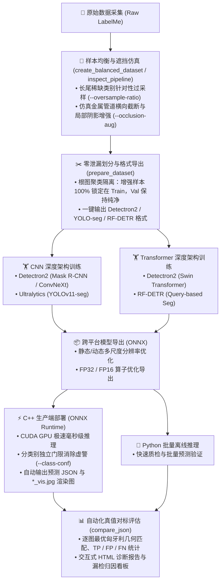

# Universal Instance Segmentation

<p align="center">
  
  
  
  
  
  
  
  
  
</p>

通用工业级实例分割框架，**深度支持 CNN（卷积神经网络：Mask R-CNN, ConvNeXt, YOLO）与 Transformer（自注意力机制：Swin Transformer, RF-DETR）两大主流深度学习架构**。提供 **Detectron2 Mask R-CNN**、**Ultralytics YOLO-seg** 和 **RF-DETR** 三大高性能后端支持。项目打通了**自建数据集划分与预处理、长尾均衡与物理遮挡仿真、在线数据增强、模型微调训练、ONNX 跨平台导出、C++/Python 双端推理**以及 **LabelMe 自动化对比评测**的全流程闭环。代码架构纯净通用，用户可直接在自己的自定义工业或自动化视觉数据集上开箱即用。

## 1. 结构说明

```shell
.
├── instance_segmentation/                  # Python 包与统一 CLI 工具
│   ├── data/                               # LabelMe / COCO / YOLO 数据集转换与预处理
│   ├── evaluation/                         # compare_json 精度评测与 HTML 可视化报告生成
│   └── models/                             # 三大后端：训练、推理、ONNX 导出
│       ├── detectron2_maskrcnn/
│       ├── ultralytics_yolo/
│       └── rfdetr/
├── cpp/                                    # C++ / ONNX Runtime 高性能推理引擎
│   ├── models/                             # 各后端对应的 C++ 前后处理与推理器
│   ├── CMakeLists.txt                      # 统一 CMake 构建工程
│   └── scripts/                            # 依赖拉取脚本 (OpenCV, ONNX Runtime)
├── scripts/                                # 通用数据集切分转换与训练辅助脚本
├── pretrained/                             # 预训练权重存放目录
└── pyproject.toml                          # Python 环境与依赖配置
```

### 支持后端与模型规格

| 后端名称 | 深度学习架构范式 | CLI 标识 | Python 模块 | C++ 目标可执行文件 | 支持尺寸 / 骨干网络 (Backbone) |
|---|---|---|---|---|---|
| **Detectron2 Mask R-CNN** | **CNN / Transformer** 双模 | `detectron2` (别名 `maskrcnn`) | `models/detectron2_maskrcnn` | `detectron2_maskrcnn_infer` (`_cuda`) | **CNN**: ResNet (`r50/r101/r152`), ResNeXt (`x101`), ConvNeXt<br>**Transformer**: Swin (`swin_t/s/b/l`) |
| **Ultralytics YOLO-seg** | **CNN** (单阶段高效卷积) | `ultralytics` (别名 `yolo`) | `models/ultralytics_yolo` | `ultralytics_yolo_infer` (`_cuda`) | YOLOv11 (`n/s/m/l/x`), YOLO26 (`n/s/m/l/x`), YOLOv8 (`n/s/m/l/x`) |
| **RF-DETR** | **Transformer** (端到端 Query) | `rfdetr` (别名 `rf-detr`) | `models/rfdetr` | `rfdetr_infer` (`_cuda`) | RF-DETR Seg (`nano`, `small`, `medium`, `large`, `xlarge`, `2xlarge`) |

> **统一规范**：所有类别名称均建议统一抽象为 `class1, class2, ...`，类别顺序必须在数据集标注、训练、导出、推理和评估中保持严格一致。

---

## 2. 环境配置与快速上手

### 2.1 Python 环境

要求 Python >= 3.10，推荐使用 Conda 虚拟环境：

> Ubuntu 18.04 请使用下面的 [2.1.1 Ubuntu 18.04 安装](#211-ubuntu-1804-安装)完整流程，不要与本节的通用流程叠加执行。

```bash
git clone https://github.com/zhangnatha/universal_instance_segmentation.git
cd universal_instance_segmentation
conda create -n uiseg python=3.10 -y
conda activate uiseg

# 安装与硬件匹配的 PyTorch (以 CUDA 12.4 为例，CPU 环境请参考官方命令)
pip install torch torchvision --index-url https://download.pytorch.org/whl/cu124

# 安装核心依赖
pip install -e '.[data,evaluation,export]'

# 按需安装模型后端
pip install --no-build-isolation "git+https://github.com/facebookresearch/detectron2.git@v0.6"  # Detectron2
pip install -e '.[ultralytics]'                                # YOLO-seg
pip install -e '.[rfdetr]'                                     # RF-DETR

# 或者一键安装全部依赖
pip install -e '.[all]'
```

### 2.1.1 Ubuntu 18.04 安装

Ubuntu 18.04 请使用 Conda 创建 Python 3.10 环境，并按以下固定版本流程安装。若尚未获取仓库，先执行以下命令；已有仓库则直接进入仓库根目录。根据实际环境选择 CUDA 11.8、CUDA 12.1 或纯 CPU 中的一种 PyTorch 安装方式；下面默认启用 CUDA 11.8，选择其他方式时注释该行并取消对应命令的注释。

```bash
git clone https://github.com/zhangnatha/universal_instance_segmentation.git
cd universal_instance_segmentation

conda create -n uiseg python=3.10 -y
conda activate uiseg

conda install -c conda-forge gcc_linux-64=9 gxx_linux-64=9 -y

# CUDA 11.8
pip install torch==2.5.0 torchvision==0.20.0 --index-url https://download.pytorch.org/whl/cu118

# CUDA 12.1
# pip install torch==2.5.0 torchvision==0.20.0 --index-url https://download.pytorch.org/whl/cu121

# 纯 CPU 测试
# pip install torch==2.5.0 torchvision==0.20.0 --index-url https://download.pytorch.org/whl/cpu

# Detectron2 v0.6
pip install --no-build-isolation "git+https://github.com/facebookresearch/detectron2.git@v0.6"

# 额外二进制依赖
pip install -i https://pypi.org/simple --only-binary=:all: pyarrow libcst wandb "av>=14.2,<16"

# 安装项目及全部可选依赖
pip install -e '.[all]'

# 验证
python -c "
import torch, torchvision, detectron2
print('PyTorch:', torch.__version__, '| CUDA available:', torch.cuda.is_available())
print('Detectron2:', detectron2.__version__)"
```

### 2.2 C++ 推理引擎编译

依赖 OpenCV 4 和 ONNX Runtime（全面支持 **Ubuntu 18.04+** 与 **Windows 10/11**，支持 CPU 与 CUDA GPU 推理）：

```bash
# 1. 下载本地依赖 (已自动忽略于 Git；Linux 使用 .sh，Windows 使用对应 .ps1)
./cpp/scripts/fetch_onnxruntime.sh
./cpp/scripts/fetch_opencv.sh

# 2. 编译 CPU 目标（CMake 自动发现 3rdparty 依赖）
cmake -S cpp -B cpp/build
cmake --build cpp/build -j4

# 3. 编译 GPU (CUDA) 目标 (生成对应 *_cuda 可执行程序)
cmake -S cpp -B cpp/build -DBUILD_GPU=ON
cmake --build cpp/build -j4

# 4. Windows 平台编译 (MSVC x64)
# cmake -S cpp -B cpp/build -G "Visual Studio 17 2022" -A x64
# cmake --build cpp/build --config Release --parallel 4
```

> [!TIP]
> **旧系统与跨平台兼容**：CMake 工程内置 `glibc 2.27` 兼容层适配（支持 Ubuntu 18.04 及以上系统），针对 Windows MSVC 自动适配安全时间与标准文件系统 API。

---

## 3. 全流程 Pipeline 与数据准备



三大后端在训练期间均需要独立的验证集（Validation Set）用于监控收敛曲线并保存最佳模型权重。因此，**在进入训练命令行之前，必须先将原始平铺标注数据进行拆分与格式预处理**。

### 3.1 一键数据集拆分与格式转换

项目提供通用的数据集预处理转换脚本 `scripts/prepare_dataset.py`，支持将任意存放图片和 LabelMe JSON 文件的单一目录，一键按比例划分为 `train` 和 `val`，并输出三大模型所需的标准格式：

```bash
python scripts/prepare_dataset.py \
  --source-dir /data/my_dataset/raw_labelme \
  --output-dir /data/my_dataset/prepared \
  --classes class1 class2 class3 class4 \
  --val-ratio 0.1 \
  --format all
```

| 参数 | 含义 | 用法示例 | 推荐使用场合 |
|---|---|---|---|
| `--source-dir` | 原始平铺标注数据目录（含图片与 LabelMe JSON） | `--source-dir /data/raw` | **必选**。采集好的原始平铺标注数据目录 |
| `--output-dir` | 划分与格式转换后的输出根目录 | `--output-dir /data/prepared` | **必选**。输出目录，自动按框架分类存储 |
| `--classes` | 需要提取与索引化的目标类别列表（按固定顺序） | `--classes class1 class2 class3 class4` | **必选**。全生命周期（训练/导出/推理/评测）保持顺序一致 |
| `--val-ratio` | 验证集所占比例（0.0 ~ 1.0） | `--val-ratio 0.1` | 默认 `0.1`。推荐 `0.1 ~ 0.2`，自动避免增强样本泄漏 |
| `--format` | 导出的目标模型后端格式 | `--format all` | 推荐 `all`，一次性导出 Detectron2、YOLO、RF-DETR |
| `--resize` | 静态规整缩放图像与标注多边形宽高 `[W H]` | `--resize 640 640` | 可选。希望离线统一直径或加速训练读取时使用 |

执行后将自动生成结构规范的子目录：
* **Detectron2**：`/data/my_dataset/prepared/detectron2/`（含 `train/` 与 `val/` 独立 LabelMe 标注子目录）。
* **YOLO-seg**：`/data/my_dataset/prepared/yolo/`（含 `images/train/`, `images/val/`, `labels/train/`, `labels/val/` 与标准 `data.yaml`）。
* **RF-DETR**：`/data/my_dataset/prepared/rfdetr/`（含 `train/` 与 `valid/`，各内置标准的 `_annotations.coco.json` 实例分割标注）。

> [!TIP]
> **可选预缩放**：若需要将图像提前规整到统一分辨率（如 432x432 或 640x640）以提升训练读取速度，可在命令后附加 `--resize 640 640`（脚本将自动对图像和多边形坐标执行等比例几何缩放）。

---

## 4. 数据预处理与图像数据增强策略

理解**训练前预处理**与**训练时在线增强**的区别：
* **训练前离线预处理**：指数据集划分、格式转换、长尾样本均衡或静态规整尺寸。在执行训练命令前由脚本在磁盘上完成。
* **训练时在线动态增强**：由模型内部的 DataLoader 在每次训练读取批次时在内存中动态随机计算（如旋转、调光、随机擦除等）。**无需在磁盘上保存大量膨胀的增广图像**，既节省磁盘空间，又避免静态过拟合。

### 4.1 数据预处理策略

| 预处理方法 | 功能与适用场景 | 执行阶段与用法示例 |
|---|---|---|
| **数据集划分 (Train/Val Split)** | 将单一标注目录按设定比例（如 9:1 或 8:2）划分为训练集和验证集，验证集用于保存最优模型权重。 | **训练前执行**：<br>`python scripts/prepare_dataset.py --source-dir /path/to/raw --output-dir /path/to/out --val-ratio 0.1` |
| **标注格式转换与规范化** | 将通用的 LabelMe 多边形标注批量转为 Detectron2、YOLO 分割 txt 或 COCO 实例分割格式。 | **训练前执行**：<br>`python scripts/prepare_dataset.py --format all --classes class1 class2` |
| **直接拉伸缩放 (Stretch Resize)** | 统一输入分辨率（如 432x432 或 640x640），图像填满感受野，避免 Padding 产生大面积黑边导致特征提取单元浪费。 | **训练前执行**：`--resize 640 640`<br>或训练参数：`--resolution 432` / `--imgsz 640` |
| **类别均衡与遮挡仿真增强** | 统计各类别实例频次，对长尾或极少样本类别进行针对性过采样与权重平衡，并可启用 `--occlusion-aug` 注入仿真横向管道遮挡与阴影增强，攻克严重物理遮挡下的漏检。 | **训练前执行**：<br>`python scripts/create_balanced_dataset.py --source /path/to/raw --output output/train_balanced --oversample-classes class3 --oversample-ratio 3 --occlusion-aug` |
| **困难负样本挖掘 (Hard Negatives)** | 将现场无目标背景图、易误检干扰物加入训练集作为负样本，显式抑制模型在复杂背景下的虚警 (FP)。 | **训练前准备**并在训练时挂载：<br>`--hard-negative-dir /path/to/negatives --hard-negative-repeat 2` |

### 4.2 图像数据增强策略

| 增强策略 | 功能原理与解决问题 | 训练时启用参数与用法示例 (在线动态生成) |
|---|---|---|
| **物理小角度旋转 (Small Rotation)** | 严格在小范围（如 ±5°）内微调旋转，不破坏重力方向先验；赋予模型抗相机微小震颤、视角轻度偏转的能力，有效消除因轻微形变引起的漏检。 | `--augment --augment-rotation --rotation-range -5.0 5.0 --rotation-prob 0.5` |
| **自适应亮度与对比度调整 (Brightness/Contrast)** | 随机在 [0.85, 1.15] 范围内微调亮度和对比度，模拟现场光源强弱波动、镜头透光率衰减与高光反光，提升暗区与反光边缘辨别度。 | `--augment-brightness --brightness-range 0.85 1.15 --brightness-prob 0.5`<br>`--augment-contrast --contrast-range 0.85 1.15 --contrast-prob 0.5` |
| **LAB空间自适应直方图均衡化 (LAB-CLAHE)** | 转换至 LAB 空间仅对 L 亮度通道做局部对比度受限均衡；在不高光过曝失真的前提下，自适应提亮极暗区域纹理，显著降低暗部微小目标漏检。 | `--augment-clahe --clahe-clip-limit 2.0 --clahe-prob 0.25` |
| **关键微小目标聚焦裁剪 (FocusCrop)** | 围绕占比极小的核心关键目标真实框按比例截取局部区域并放大训练，将小目标特征覆盖率提升数倍，攻克深层网络下采样稀释问题。 | `--focus-crop-classes class3 class4 --focus-crop-prob 0.25 --focus-crop-scale 3.0` |
| **局部随机擦除 (Random Erasing)** | 随机在图像上产生 1%~4% 面积的擦除遮挡块，强迫模型学习基于不完整轮廓与上下文关系进行推理，大幅提升复杂遮挡下的鲁棒性。 | `--augment-erasing --erasing-prob 0.25 --erasing-smin 0.01 --erasing-smax 0.04` |
| **多尺度训练采样 (Multi-Scale)** | 训练期间在给定尺寸范围内随机变换短边尺度，迫使卷积与注意力机制适应同一目标在不同工作距离下的尺度变化。 | `--multi-scale --min-size 480 512 544 576 608 640 --max-size 800` |
| **实例级复制粘贴 (Copy-Paste)** | 从其它图像中抠取实例并随机融合粘贴到当前样本，极大扩充稀缺目标与多目标重叠交叉的上下文样本多样性。 | `--copy-paste --copy-paste-prob 0.3 --copy-paste-max-objects 3` |

### 4.3 独立数据集预处理、图像增强与可视化审查看板 (`inspect_dataset_pipeline.py`)

为了直观查看和核验原始数据经过拆分、预处理、过采样与图像遮挡增强后的具体效果，项目提供了全流程一体化审查流水线 `scripts/inspect_dataset_pipeline.py`。该脚本将处理结果完整存放在一个**完全独立的文件夹**中，方便人工逐张审查和多模型直接复用：

```bash
python scripts/inspect_dataset_pipeline.py \
  --source-dir /data/my_dataset/raw_labelme \
  --output-dir /data/my_dataset_inspected \
  --classes class1 class2 class3 class4 \
  --val-ratio 0.1 \
  --oversample-classes class3 \
  --oversample-ratio 3 \
  --occlusion-aug \
  --vis-samples 80
```

| 参数 | 含义 | 用法示例 | 推荐使用场合 |
|---|---|---|---|
| `--source-dir` | 原始平铺数据输入路径 | `--source-dir /data/raw` | **必选**。原始图片与 LabelMe 标注文件目录 |
| `--output-dir` | 独立审查工作区输出路径 | `--output-dir /data/inspected` | **必选**。生成隔离的查看、验证与训练就绪目录 |
| `--classes` | 目标类别名称列表 | `--classes class1 class2 ...` | **必选**。指定关注的检测分割类别（顺序严格对齐） |
| `--val-ratio` | 纯净验证集划分比例 | `--val-ratio 0.1` | 默认 `0.1`。保证原图分组隔离，100% 无增强数据泄漏 |
| `--oversample-classes`| 需针对性扩增的长尾稀缺类别 | `--oversample-classes class3` | 当某些关键类别出现频次极低时使用，针对性过采样，扩增样本 100% 锁定在 Train 保证零泄漏 |
| `--oversample-ratio`  | 稀缺样本扩增倍数 | `--oversample-ratio 3` | 推荐 `2 ~ 4` 倍，使长尾稀缺样本的曝光权重与共有高频类别平衡 |
| `--occlusion-aug`     | 注入横向金属管道与阴影遮挡仿真 | `--occlusion-aug` | 工业工位中目标易被设备钢管、横梁、电缆横截遮挡时必选，大幅提升残缺轮廓下的判别置信度 |
| `--vis-samples`       | 自动渲染的质检可视化图上限 | `--vis-samples 80` | 生成半透明 Mask 叠加图至 `preview_vis/`，便于人工审核增强效果 |

#### 输出目录结构与功能解析
```shell
my_dataset_inspected/
├── train/                  # 包含基础训练样本与增强后样本 (原图 + LabelMe JSON，可直接用 LabelMe 打开)
├── val/                    # 纯净验证集 (100% 无数据泄漏真实原图 + LabelMe JSON)
├── preview_vis/            # 【直观审查】自动渲染半透明多边形分割 Mask、外接框与标签的预览图
│   ├── augmented_samples/  # 注入管道物理遮挡、局部 Cutout 与阴影增强的样本渲染效果
│   ├── train_clean_samples/# 训练集未增强的干净样本渲染效果
│   └── val_samples/        # 验证集样本渲染效果
├── exports/                # 【三大模型开箱即用】一键转换后的训练就绪格式
│   ├── detectron2/         # train/ 与 val/ 独立目录
│   ├── yolo/               # images/train, images/val, labels/train, labels/val, data.yaml
│   └── rfdetr/             # train/ 与 valid/ 目录，内含 _annotations.coco.json
├── index.html              # 【交互式网页看板】浏览器双击即开，查看增强前后数据分布图表与图库
└── dataset_summary.json    # 处理全生命周期元数据与类别实例数量统计 JSON
```

---

## 5. 模型训练

三大后端的训练入口**完全统一对齐**，均直接消费第 3 节中预先拆分准备好的数据集目录。

### 5.1 Detectron2 Mask R-CNN 训练

Detectron2 直接接收预先切分好的 `--train-dir` 和 `--val-dir` 独立目录进行训练：

```bash
python -m instance_segmentation.models.detectron2_maskrcnn.train \
  --train-dir /data/my_dataset/prepared/detectron2/train \
  --val-dir /data/my_dataset/prepared/detectron2/val \
  --classes class1 class2 class3 class4 \
  --backbone swin_s \
  --output-dir output/detectron2_swin_s \
  --max-iter 12000 --batch-size 4 --base-lr 1e-4 \
  --lr-scheduler WarmupCosineLR --warmup-iters 100 \
  --device cuda --amp --multi-scale \
  --augment --augment-rotation --rotation-range -5.0 5.0 --rotation-prob 0.5 \
  --augment-brightness --brightness-range 0.85 1.15 --brightness-prob 0.5 \
  --augment-contrast --contrast-range 0.85 1.15 --contrast-prob 0.5 \
  --num-workers 4
```

| 参数 | 含义 | 用法示例 | 推荐使用场合 |
|---|---|---|---|
| `--train-dir` / `--val-dir` | 训练集与验证集独立目录路径 | `--train-dir /path/train` | **必选**。输入包含图片与 LabelMe JSON 的目录 |
| `--classes` | 目标类别列表（空格分隔，顺序固定） | `--classes class1 class2` | **必选**。全流程严格保持顺序对齐 |
| `--backbone` | 特征提取主干网络架构 | `--backbone swin_s` | CNN 选 `r50/r101/x101/convnext`；Transformer 选 `swin_t/s/b`；加载自训练权重时须与其架构相符 |
| `--backbone-impl` | 现代主干网络实现 | `--backbone-impl native` | 可选 `native/timm`；须与主干和 checkpoint 匹配 |
| `--freeze-at`、`--resnet-norm` | 主干冻结阶段与 ResNet 归一化层 | `--freeze-at 0 --resnet-norm BN` | 按 backbone 架构调整；通常保持 checkpoint 训练时的配置 |
| `--weights` | 已有 Detectron2 `.pth` 模型权重 | `--weights /path/to/model.pth` | 用模型权重初始化新 run，不恢复优化器、调度器或迭代状态；使用新的 `--output-dir`。类别名和顺序须匹配；类别数变化会使形状不匹配的预测层重新初始化并在日志提示 |
| `--resume` | 从 `--output-dir/last_checkpoint` 恢复训练状态 | `--resume` | 恢复原 run 的模型、优化器、调度器和迭代状态；继续使用原输出目录，不接受 checkpoint 路径 |
| `--from-scratch` | 随机初始化模型 | `--from-scratch` | 从零训练；与 `--weights`、`--pretrained-backbone` 互斥，且不可与 `--resume` 同用 |
| `--pretrained-backbone` | 使用官方 ImageNet backbone 权重初始化 | `--pretrained-backbone` | 只初始化 backbone；与 `--weights`、`--from-scratch` 互斥，且不可与 `--resume` 同用；所选 backbone 须对应相应预训练结构 |
| `--experiment` | 数据集注册名称 | `--experiment training` | 指定内部数据集注册名 |
| `--auto-split`、`--val-ratio`、`--split-seed` | 从 `--train-dir` 自动划分验证集 | `--auto-split --val-ratio 0.2 --split-seed 42` | 与 `--val-dir` 互斥；未指定 split seed 时沿用 `--seed` |
| `--hard-negative-dir`、`--hard-negative-repeat` | 加入空标注困难负样本及其采样重复次数 | `--hard-negative-dir /data/negatives --hard-negative-repeat 1` | 仅使用训练来源生成的负样本，不能与验证/测试图像重叠 |
| `--output-dir` | 模型检查点与日志存放目录 | `--output-dir output/d2_swin` | 产出 `model_best.pth` 与 TensorBoard 曲线 |
| `--max-iter` / `--batch-size` | 训练总迭代步数与单批次样本量 | `--max-iter 12000 --batch-size 4` | 依据数据量调整，建议总训练步数等效于 30~50 Epoch |
| `--base-lr` / `--lr-scheduler` | 初始基础学习率与调度策略 | `--base-lr 1e-4 --lr-scheduler WarmupCosineLR` | CNN 推荐 `1e-3`；Swin Transformer 推荐 `1e-4` 配合余弦退火 |
| `--lr-steps`、`--lr-gamma`、`--warmup-iters`、`--warmup-factor`、`--warmup-method` | 学习率里程碑、衰减倍率与 warmup 设置 | `--lr-steps 8000 10000 --warmup-iters 200` | 按总迭代数调整；`--lr-steps` 可省略数值表示空里程碑 |
| `--weight-decay`、`--weight-decay-norm`、`--weight-decay-bias`、`--bias-lr-factor` | 权重衰减及 bias 学习率设置 | `--weight-decay 0.0001 --weight-decay-norm 0` | 覆盖优化器的通用、归一化层和 bias 参数设置 |
| `--optimizer`、`--momentum`、`--nesterov`、`--adam-beta1`、`--adam-beta2`、`--adam-eps` | 优化器及其动量/数值稳定参数 | `--optimizer adamw --adam-beta1 0.9 --adam-beta2 0.999` | `--momentum` / `--nesterov` 用于 SGD；Adam 参数用于 AdamW |
| `--clip-gradients`、`--gradient-clip-type`、`--gradient-clip-value`、`--gradient-clip-norm`、`--gradient-clip-norm-type` | 梯度裁剪开关、类型和阈值 | `--gradient-clip-type norm --gradient-clip-norm 5` | 可按训练稳定性调整裁剪方式 |
| `--checkpoint-period`、`--eval-period`、`--save-best`、`--early-stop-patience`、`--early-stop-metric` | 检查点间隔、验证间隔、最佳权重保存与早停 | `--checkpoint-period 1000 --eval-period 500 --early-stop-patience 10` | 最佳权重与早停需要验证集 |
| `--device` / `--amp` | 计算设备与混合精度加速 | `--device cuda --amp` | GPU 环境推荐启用 `--amp`，节省显存并提速 30%+ |
| `--tf32`、`--cudnn-benchmark` | TF32 矩阵/卷积与 cuDNN kernel 调优 | `--tf32 --cudnn-benchmark` | 适用于支持的 NVIDIA GPU |
| `--augment-*` | 在线动态图像增强组合开关 | `--augment-rotation --rotation-range -5.0 5.0` | 内存中动态旋转、调光、CLAHE 局部均衡，提升泛化抗噪能力 |
| `--num-workers` | 数据加载子进程并发数 | `--num-workers 4` | 推荐设为 CPU 核心数的 1/2，加速 DataLoader 吞吐 |
| `--pin-memory`、`--persistent-workers`、`--prefetch-factor` | DataLoader 锁页内存、常驻 worker 和预取批次数 | `--num-workers 4 --prefetch-factor 2` | `pin-memory` 缺省时随设备决定；persistent workers 仅在 workers 大于 0 时生效 |
| `--min-size`、`--max-size`、`--multi-scale`、`--random-flip`、`--train-size-sampling` | 输入尺寸、多尺度、翻转及训练短边采样 | `--min-size 480 --max-size 800 --multi-scale --random-flip horizontal` | `--train-size-sampling` 可选 `choice/range` |
| `--mask-format`、`--aspect-ratio-grouping`、`--filter-empty-annotations`、`--sampler-train`、`--repeat-sqrt`、`--repeat-threshold` | mask 编码、批次分组、空标注过滤及类别重复采样 | `--mask-format polygon --sampler-train RepeatFactorTrainingSampler` | 重复采样阈值仅在相应 sampler 下生效 |
| `--nms-threshold`、`--max-detections`、`--roi-batch-size-per-image`、`--roi-positive-fraction` | ROI/NMS 设置和每图检测上限 | `--roi-batch-size-per-image 512 --nms-threshold 0.5` | 调整 ROI 采样及验证时的检测上限 |
| `--rpn-batch-size-per-image`、`--rpn-positive-fraction`、`--rpn-nms-threshold`、`--rpn-pre-nms-topk-train`、`--rpn-post-nms-topk-train`、`--rpn-pre-nms-topk-test`、`--rpn-post-nms-topk-test`、`--small-object-anchors` | RPN anchor、采样、NMS 与候选框数量设置 | `--small-object-anchors --rpn-batch-size-per-image 256` | 更换 anchor 设置时检查 checkpoint 的 RPN 权重兼容性 |
| `--augment`、`--augment-rotation`、`--rotation-range`、`--rotation-prob`、`--augment-translation`、`--translation-range`、`--translation-prob` | 总增强开关及旋转/平移增强范围与概率 | `--augment-rotation --rotation-range -5 5 --rotation-prob 0.5` | 按场景调整增强幅度及执行概率 |
| `--augment-brightness`、`--brightness-range`、`--brightness-prob`、`--augment-contrast`、`--contrast-range`、`--contrast-prob`、`--augment-clahe`、`--clahe-clip-limit`、`--clahe-prob` | 亮度、对比度与 CLAHE 增强 | `--augment-brightness --brightness-range 0.85 1.15 --augment-clahe` | 依数据光照变化启用并调整范围/概率 |
| `--augment-low-resolution`、`--low-resolution-scale`、`--low-resolution-prob`、`--augment-erasing`、`--erasing-prob`、`--erasing-smin`、`--erasing-smax` | 低分辨率与随机擦除增强 | `--augment-low-resolution --low-resolution-scale 0.6 --augment-erasing` | 模拟成像质量下降或局部遮挡 |
| `--augment-copy-paste`、`--copy-paste-prob`、`--copy-paste-classes`、`--copy-paste-max-instances`、`--copy-paste-max-bbox-iou` | 从训练集粘贴实例的数据增强 | `--augment-copy-paste --copy-paste-prob 0.25 --copy-paste-classes class3` | 可限制来源类别、实例数和框重叠 |
| `--focus-crop-class`、`--focus-crop-classes`、`--focus-crop-prob`、`--focus-crop-scale`、`--focus-crop-min-size` | 对指定类别启用目标聚焦裁剪 | `--focus-crop-classes class3 --focus-crop-prob 0.25 --focus-crop-scale 3` | 放大微小目标局部；选择单类别或类别列表 |
| `--angle-head`、`--angle-classes`、`--angle-bins`、`--angle-period`、`--angle-loss-weight`、`--angle-lr-factor`、`--angle-label-source` | 可选角度预测头及监督配置 | `--angle-head --angle-classes class1 --angle-bins 72 --angle-period 360` | 默认关闭；监督源可选 `annotation/mask`，推理/导出须保持相同 head 配置 |
| `--seed`、`--progress`、`--validate-only`、`--max-gpu-power-watts` | 随机种子、进度条、只校验模式及 GPU 功耗上限要求 | `--seed 42 --validate-only` | 只校验模式不训练；功耗要求需预先配置 NVIDIA 功耗限制 |
| `--channels-last` | 预留的 channels-last 开关 | `--channels-last` | Detectron2 0.6 当前不支持启用该模式 |

所有 `BooleanOptionalAction` 布尔参数均自动提供对应的 `--no-*` 关闭形式；`--resume` 和 `--validate-only` 等单向开关除外。

### 5.2 Ultralytics YOLO-seg 训练

```bash
python -m instance_segmentation.models.ultralytics_yolo.train \
  --data /data/my_dataset/prepared/yolo/data.yaml \
  --model-id yolov11 \
  --size small \
  --epochs 100 \
  --imgsz 640 \
  --batch 8 \
  --device 0 \
  --project output \
  --name yolo11s_seg \
  --amp \
  --workers 4
```

| 参数 | 含义 | 用法示例 | 推荐使用场合 |
|---|---|---|---|
| `--data` | YOLO 数据集配置文件路径 | `--data /path/data.yaml` | **必选**。指定包含训练/验证路径与类别定义的 yaml |
| `--model-id` | YOLO 系列代际架构 (CNN) | `--model-id yolov11` | 工业落地推荐 `yolov11`，亦兼容 `yolo26` 与 `yolov8` |
| `--size` | 模型容量规格阶梯 | `--size small` | 端侧/嵌入式选 `nano/small`；高性能工作站选 `medium/large` |
| `--weights` | 已有 Ultralytics `.pt` 权重 | `--weights /path/to/best.pt` | 用权重初始化新 run，不恢复优化器或 epoch；新 run 使用新的 `--project` / `--name`。模型规格及 `data.yaml` 类别名/顺序须核对 |
| `--resume` | 恢复当前加载的训练 checkpoint | `--weights /path/to/last.pt --resume` | 用含 epoch/optimizer 状态的 `last.pt` 恢复；没有训练状态时框架警告并按权重初始化开始新 run |
| `--epochs` / `--batch` (`--batch-size`) | 训练总轮数与单批次样本数 | `--epochs 100 --batch 8` | 单阶段卷积架构推荐训练 `80 ~ 120` Epoch 充分拟合 |
| `--imgsz` | 训练输入方阵尺寸 | `--imgsz 640` | 默认 640，兼顾推理效率与掩膜边缘精细度 |
| `--device` | 训练使用的 GPU 设备卡号 | `--device 0` | 单卡填 `0`，多卡填 `0,1`，无显卡设 `cpu` |
| `--project` / `--name` | 训练输出项目目录与实验名称 | `--project output --name yolo11s` | 权重产物保存在 `output/yolo11s/weights/best.pt` |
| `--amp` | 开启 FP16 自动混合精度训练 | `--amp` | 推荐开启，显著降低显存开销并提升训练吞吐 |
| `--workers` | DataLoader worker 数 | `--workers 4` | 按 CPU 和存储吞吐调整；CLI 默认 4 |

`--amp` 支持 `--no-amp`；`--resume` 是单向开关。恢复时应提供同一 run 的含训练状态 `last.pt`。

### 5.3 RF-DETR 训练

```bash
python -m instance_segmentation.models.rfdetr.train \
  --data /data/my_dataset/prepared/rfdetr \
  --size small \
  --resolution 432 \
  --epochs 50 \
  --batch 4 \
  --lr 1e-4 \
  --output-dir output/rfdetr_small \
  --devices 1
```

| 参数 | 含义 | 用法示例 | 推荐使用场合 |
|---|---|---|---|
| `--data` | RF-DETR 数据集根目录 | `--data /path/rfdetr` | **必选**。内含 train 与 valid 目录及 `_annotations.coco.json` |
| `--size` | Transformer 骨干与解码器尺寸 | `--size small` | 推荐 `small`，平衡实时推理帧率与复杂遮挡判别能力 |
| `--weights` (`--pretrain-weights`) | RF-DETR `.pth` / `.pt` 初始化权重 | `--weights /path/to/checkpoint.pth` | 用权重初始化新 run，不恢复优化器或 epoch；使用新的 `--output-dir`，且 `--size`、分辨率和类别定义须匹配 |
| `--resume` | 恢复指定 RF-DETR 训练 checkpoint | `--resume /path/to/checkpoint.pth` | 恢复训练状态；完整恢复需使用含优化器/调度器状态的 trainer checkpoint，EMA/best 权重文件不一定包含这些状态 |
| `--resolution` | 模型多尺度输入方阵分辨率 | `--resolution 432` | 极速推理选 `432`（耗时仅 10ms）；追求极细小边缘选 `640` |
| `--epochs` | 训练总轮数 (配合 EMA 权重保存) | `--epochs 50` | DETR 架构对遮挡残缺目标特征拟合推荐训练 `40 ~ 50` 轮 |
| `--batch` / `--lr` | 批次大小与 AdamW 学习率 | `--batch 4 --lr 1e-4` | 显存 $\ge$ 8GB 推荐 batch=4，单卡基准学习率 `1e-4` |
| `--output-dir` | 检查点与 EMA 最优权重输出目录 | `--output-dir output/rfdetr_small` | 产出供导出的 `checkpoint_best_ema.pth` |
| `--devices` | 训练所占用的 GPU 设备数量 | `--devices 1` | 单卡设 `1`，多卡按实际物理卡数量传入 |
| `--batch-size` | `--batch` 的别名 | `--batch-size 4` | 与 `--batch` 二选一设置批次大小 |
| `--accelerator` | 训练加速设备 | `--accelerator cuda` | 支持 `auto/cuda/cpu` |
| `--eval-interval` | 验证间隔（epoch） | `--eval-interval 1` | 默认每个 epoch 验证一次 |

---

## 6. 模型导出 (ONNX)

将训练完成的权重统一导出为标准的 ONNX 格式，供 C++/ONNX Runtime 或端侧部署引擎加载。

### 6.1 Detectron2 Mask R-CNN 导出

```bash
# 导出为固定空间尺寸的 ONNX 模型
python -m instance_segmentation.models.detectron2_maskrcnn.export \
  --weights output/detectron2_swin_s/model_best.pth \
  --sample /data/my_dataset/prepared/detectron2/val/sample.jpg \
  --output output/onnx/d2_swin_s.onnx \
  --classes class1 class2 class3 class4 \
  --backbone swin_s \
  --precision fp32 --opset 17
```

| 参数 | 含义 | 用法示例 | 推荐使用场合 |
|---|---|---|---|
| `--weights` | 训练产出的 PyTorch 检查点路径 | `--weights output/d2/model_best.pth` | **必选**。待转换的模型权重 |
| `--sample` | 参考样本图像路径 | `--sample /path/sample.jpg` | **必选**。用于追踪模型静态尺寸计算图 |
| `--output` | 目标 ONNX 模型输出路径 | `--output output/onnx/d2.onnx` | **必选**。生成的文件供 C++ 引擎加载 |
| `--classes` | 类别名称列表（严格顺序） | `--classes class1 class2 ...` | **必选**。绑定类别头输出映射 |
| `--backbone` | 对应训练时的主干网络标识 | `--backbone swin_s` | 需与训练参数严格一致 |
| `--precision` / `--opset` | 权重数值精度与 ONNX 算子集版本 | `--precision fp32 --opset 17` | 推荐 `opset 17`，兼具先进性与运行时兼容度 |

### 6.2 Ultralytics YOLO-seg 导出

```bash
python -m instance_segmentation.models.ultralytics_yolo.export \
  --weights output/yolo11s_seg/weights/best.pt \
  --imgsz 640 \
  --format onnx \
  --classes class1 class2 class3 class4
```

| 参数 | 含义 | 用法示例 | 推荐使用场合 |
|---|---|---|---|
| `--weights` | 训练输出的 best.pt 路径 | `--weights output/yolo/best.pt` | **必选**。待导出的 PyTorch 权重 |
| `--imgsz` | 导出模型的输入方阵尺寸 | `--imgsz 640` | 与部署端实际推理输入尺寸保持一致 |
| `--format` | 导出的模型目标格式 | `--format onnx` | **必选**。导出为通用 ONNX 计算图 |
| `--classes` | 类别名称映射序列 | `--classes class1 class2 ...` | **必选**。在模型元数据中内嵌类别标签 |

### 6.3 RF-DETR 导出

```bash
python -m instance_segmentation.models.rfdetr.export \
  --weights output/rfdetr_small/checkpoint_best_ema.pth \
  --output-dir output/onnx/rfdetr_small \
  --size small \
  --resolution 432 \
  --opset 17 \
  --batch-size 1
```

| 参数 | 含义 | 用法示例 | 推荐使用场合 |
|---|---|---|---|
| `--weights` | RF-DETR EMA 权重文件路径 | `--weights output/rfdetr/checkpoint_best_ema.pth` | **必选**。首选指数移动平均权重 |
| `--output-dir` | ONNX 文件输出目录 | `--output-dir output/onnx/rfdetr` | **必选**。自动生成规范命名的 ONNX 文件 |
| `--size` / `--resolution` | 模型规格与输入多尺度分辨率 | `--size small --resolution 432` | 必须与训练时的参数保持严格一致 |
| `--opset` / `--batch-size` | ONNX 算子集版本与推理批次固定尺寸 | `--opset 17 --batch-size 1` | 生产端工位部署推荐固定单批次 (`batch-size 1`) |

---

## 7. 推理与部署

提供 **Python 离线批量推理** 与 **C++/ONNX Runtime 生产环境高性能推理** 两套方案。双端均支持针对各类别单独配置置信度 (`--class-conf`) 与 NMS 抑制重叠阈值 (`--class-iou`)，并默认自动绘制生成高画质实例分割可视化图 (`*_vis.jpg`) 与标准化 JSON 预测。

### 7.1 Python 批量推理

```bash
# 1. Detectron2 推理 (支持指定各类别独立阈值，默认输出 JSON 与 *_vis.jpg 可视化图)
python -m instance_segmentation.models.detectron2_maskrcnn.infer \
  --weights output/detectron2_swin_s/model_best.pth \
  --input /data/my_dataset/test \
  --output results/pred_python_d2 \
  --classes class1 class2 class3 class4 \
  --backbone swin_s --device cuda \
  --class-conf class1=0.80 class2=0.80 class3=0.80 class4=0.80 \
  --class-iou class1=0.50 class2=0.50 class3=0.50 class4=0.50

# 2. YOLO-seg 推理
python -m instance_segmentation.models.ultralytics_yolo.infer \
  --weights output/yolo11s_seg/weights/best.pt \
  --source /data/my_dataset/test \
  --output results/pred_python_yolo \
  --classes class1 class2 class3 class4 \
  --class-conf class1=0.80 class2=0.80 class3=0.80 class4=0.80 \
  --class-iou class1=0.50 class2=0.50 class3=0.50 class4=0.50 \
  --device cuda

# 3. RF-DETR 推理 (批量处理图像并生成 JSON 预测与 *_vis.jpg 实例分割可视化图)
python -m instance_segmentation.models.rfdetr.infer_dataset \
  --weights output/rfdetr_small/checkpoint_best_ema.pth \
  --input /data/my_dataset/test \
  --output results/pred_python_rfdetr \
  --classes class1 class2 class3 class4 \
  --class-conf class1=0.80 class2=0.80 class3=0.80 class4=0.80 \
  --class-iou class1=0.50 class2=0.50 class3=0.50 class4=0.50 \
  --resolution 432 \
  --draw \
  --device cuda
```

| 参数 | 含义 | 用法示例 | 推荐使用场合 |
|---|---|---|---|
| `--weights` | 训练产出的 PyTorch 权重文件 (`.pth` / `.pt`) | `--weights /path/best.pth` | **必选**。指定推理所用的深度模型权重 |
| `--input` / `--source` | 待测单张图片或整个测试集文件夹路径 | `--input /data/test` | **必选**。批量自动遍历所有支持格式图像 |
| `--output` | 预测结果产物保存目录 | `--output results/pred_py` | **必选**。自动生成 `*.json` 与 `*_vis.jpg` 渲染图 |
| `--classes` | 类别名称列表（空格分隔） | `--classes class1 class2` | **必选**。严格保持与训练集映射一致 |
| `--class-conf` | **分类别独立置信度得分门限** | `--class-conf class1=0.50 class3=0.40` | **核心**：根据各类别特点设定独立阈值，彻底取代全局单一粗糙门限 |
| `--class-iou` | **分类别独立 NMS 抑制重叠阈值** | `--class-iou class1=0.50 class3=0.50` | 过滤同类别重叠多余候选框 |
| `--resolution` | 模型推理输入尺寸 (RF-DETR) | `--resolution 432` | 需与模型导出尺寸对齐 |
| `--draw` | 渲染并保存半透明实例分割可视化图 | `--draw` | 默认生成 `*_vis.jpg`，便于人工质检核对 |
| `--device` | 运行设备后端 (`cuda` 或 `cpu`) | `--device cuda` | GPU 选 `cuda`；CPU 环境选 `cpu` |

> [!NOTE]
> `python -m instance_segmentation.models.rfdetr.infer` 亦完全向前兼容以上参数格式，当传入 `--output` 时会自动调用数据集批量推理逻辑。

### 7.2 C++ / ONNX Runtime 高性能推理

C++ 可执行程序直接消费 ONNX 模型，内存开销极低且吞吐极高。默认同步输出检测 JSON 与 `*_vis.jpg` 可视化图（若在高性能生产流中不需要渲染图，可添加 `--no-draw` 关闭）。

```bash
# 1. Detectron2 C++ 推理
cpp/build/detectron2_maskrcnn_infer_cuda \
  --model output/onnx/d2_swin_s.onnx \
  --input /data/my_dataset/test \
  --output results/pred_cpp_d2 \
  --classes class1,class2,class3,class4 \
  --class-conf class1=0.80,class2=0.80,class3=0.80,class4=0.80 \
  --class-iou class1=0.50,class2=0.50,class3=0.50,class4=0.50 \
  --device cuda

# 2. YOLO-seg C++ 推理
cpp/build/ultralytics_yolo_infer_cuda \
  --model output/onnx/yolo11s_seg.onnx \
  --input /data/my_dataset/test \
  --output results/pred_cpp_yolo \
  --classes class1,class2,class3,class4 \
  --class-conf class1=0.80,class2=0.80,class3=0.80,class4=0.80 \
  --class-iou class1=0.50,class2=0.50,class3=0.50,class4=0.50 \
  --device cuda

# 3. RF-DETR C++ 推理 (支持空格或逗号分隔类别阈值，默认绘制生成 *_vis.jpg)
cpp/build/rfdetr_infer_cuda \
  --model output/onnx/rfdetr_small/rfdetr-seg-small.onnx \
  --input /data/my_dataset/test \
  --output results/pred_cpp_rfdetr \
  --classes class1,class2,class3,class4 \
  --class-conf class1=0.80,class2=0.80,class3=0.80,class4=0.80 \
  --class-iou class1=0.50,class2=0.50,class3=0.50,class4=0.50 \
  --device cuda
```

| 参数 | 含义 | 用法示例 | 推荐使用场合 |
|---|---|---|---|
| `--model` | 导出的 ONNX 模型文件路径 | `--model output/onnx/model.onnx` | **必选**。供 C++ ONNX Runtime 引擎加载 |
| `--input` | 待测图像文件或多图像目录 | `--input /data/test` | **必选**。支持主流格式图像批量遍历 |
| `--output` | 推理预测产物输出目录 | `--output results/pred_cpp` | **必选**。同步输出 C++ 结构化 JSON 与可视化图 |
| `--classes` | 类别名称列表（逗号或空格分隔） | `--classes class1,class2,class3` | **必选**。映射类别 ID 到通用业务类别名 |
| `--class-conf` | **分类别独立置信度门限** (支持逗号或空格) | `--class-conf class1=0.50,class3=0.40` | **核心**：根据各类别设置独立阈值，压制易误检类虚警并捞回难检类 |
| `--class-iou` | **分类别独立 NMS 抑制重叠阈值** | `--class-iou class1=0.50,class3=0.50` | 细调不同类别的去重抑制灵敏度 |
| `--device` | 推理运行硬件引擎后端 (`cuda` 或 `cpu`) | `--device cuda` | 生产环境首选 `cuda` GPU 加速，毫秒级极速响应 |
| `--no-draw` | 关闭可视化渲染图生成与磁盘落盘 | `--no-draw` | 极端追求高 FPS 吞吐流水线中启用，仅保存 JSON |

### 7.3 C++ 可执行程序一键打包（新机免安装运行）

为满足在新机器（Ubuntu 18.04+ 或 Windows 10/11）上无依赖快速部署的需求，项目提供一键打包功能，将已编译的二进制可执行程序、ONNX Runtime 引擎动态库、OpenCV 核心库、CUDA 运行时库、模型权重与启动脚本整体打包输出：

```bash
# 方式 1：CMake 一键打包（跨平台推荐）
cmake --build cpp/build --target package_infer

# 方式 2：独立脚本一键打包
# Linux 平台：
bash scripts/package_cpp.sh
# Windows 平台：
scripts\package_cpp.bat
```

打包生成自包含目录位于 `dist/universal_instance_segmentation_linux-x86_64`（或 Windows 下对应目录），打包产物可在**没有开发环境的全新机器**上直接解压运行：
```bash
# 新 Linux 机器上直接运行（自定位动态链接库）：
./detectron2_maskrcnn_infer --model models/model.onnx --input /path/to/test --output results/pred --classes class1,class2
# 或通过通用启动脚本调用：
./run.sh detectron2_maskrcnn_infer --model models/model.onnx --input /path/to/test --output results/pred --classes class1,class2
```

### 7.4 推理输出产物说明

推理完成后，在 `--output` 目录下将针对每张输入图像生成两类文件：
* **`[image_stem].json`**：标准化目标检测与实例分割预测文件，包含图像宽高尺寸、目标框坐标、分类类别名称、置信度得分及 Run-Length Encoding (RLE) 掩膜编码数据，可直接无缝接入第 8 节 `compare_json` 执行精度评测。
* **`[image_stem]_vis.jpg`**：实例分割可视化叠加渲染图，按类别调色板半透明填充掩膜（Alpha=0.40）、绘制多边形轮廓边缘、外接矩形框及带有类别名与分值的标签横条，便于直观核对质检。

### 7.5 推理结果转换为 LabelMe 格式

使用 `scripts/convert_to_labelme.py` 可将单个推理 JSON 或目录当前层级的全部 `*.json`（不递归子目录）转换为 LabelMe / X-AnyLabeling 标注格式。以下命令以 RF-DETR Python 推理结果为例，将转换后的 JSON 写入独立目录，避免覆盖原始预测结果。请在仓库根目录执行：

```bash
python scripts/convert_to_labelme.py \
  --input results/pred_python_rfdetr \
  --output-dir results/pred_python_rfdetr_labelme
```

`--input` 也可以直接指定单个 JSON 文件；`--output-dir` 省略时会原地覆盖输入文件，如需原地转换并保留备份，可同时添加 `--backup`。脚本只转换 JSON，不复制图片。生成的 LabelMe JSON 中 `imagePath` 使用推理 JSON 的 `file` 或 `image` 字段的文件名，`imageData` 为空，因此用 Labelme 打开时需将对应原图放在 `results/pred_python_rfdetr_labelme/` 下，或确保该相对路径能够找到原图。转换前请确认已安装脚本依赖（至少 OpenCV 与 NumPy）。

---

## 8. 模型评估与分析报告 (LabelMe 真值对标)

本项目内置自动化实例分割评估器 `compare_json`，将模型推理生成的 JSON 结果与用户测试集标注（LabelMe JSON）逐图精准匹配，生成全面的量化指标与交互式 HTML 诊断报告。

### 8.1 执行评估命令

```bash
python -m instance_segmentation.evaluation.compare_json \
  --ground-truth-dir /data/my_dataset/test \
  --prediction-dir results/pred_cpp_d2 \
  --output-dir results/eval_report \
  --iou-threshold 0.50 \
  --visualize all

# 或使用独立脚本快捷调用：
# python scripts/compare_json.py --ground-truth-dir ... --prediction-dir ... --output-dir ...
```

| 参数 | 含义 | 用法示例 | 推荐使用场合 |
|---|---|---|---|
| `--ground-truth-dir` | 测试集金标真值目录（含原图与 LabelMe JSON） | `--ground-truth-dir /data/test` | **必选**。人工标注复核的真实基准数据 |
| `--prediction-dir` | 模型推理生成的预测结果目录 | `--prediction-dir results/pred_cpp_d2` | **必选**。包含推理阶段输出的标准化 `*.json` 预测 |
| `--output-dir` | 评估报表与可视化对比图输出目录 | `--output-dir results/eval_report` | **必选**。生成 HTML 交互看板与各类统计报表 |
| `--iou-threshold` | 掩膜分割交并比判定阈值 (Mask IoU) | `--iou-threshold 0.50` | 默认 `0.50`。判定预测多边形与真值重合达标 (TP) 的交并比门限 |
| `--visualize` | 评估对比图可视化保存策略 | `--visualize all` 或 `errors` | 默认 `all` 保存全量对比图；`errors` 仅筛出漏检与虚警图 |

> [!TIP]
> **自动类别感知与免阈值过滤**：推理阶段已严格根据各类别独立门限完成前置过滤，保存下来的预测 JSON 均为有效高置信度目标，且每项预测均内嵌了所属类别标签。因此评估阶段**无需指定 `--classes` 或分数阈值**，评估器将自动发现并解析真值与预测中的所有类别，执行一对一匈牙利最优几何匹配。

### 8.2 评估产物说明

评估完成后将在 `--output-dir` 目录下生成以下交付文件：

| 输出文件 / 目录 | 内容说明 |
|---|---|
| **`analysis_report.html`** | **交互式分析报告网页**，直观展示各类别的 TP、FP、FN、Precision、Recall、F1-Score 及可视化图。 |
| `summary.csv` / `summary.json` | 总体与分难度的宏观指标汇总数据。 |
| `analysis_report.csv` | 分类别的定量指标数据表。 |
| `confusion_matrix.csv` | 类别混淆矩阵（诊断跨类别预测错误）。 |
| `per_image.csv` | 每张测试图像的明细命中统计。 |
| `visualizations/` | 预测与真值重叠覆盖对比可视化图（标注 TP 绿色、FN 蓝色、FP 红色）。 |
| `errors/` | 自动筛选出的漏检/误检错误案例特写图，便于模型迭代归因。 |

### 核心指标定义
* **TP (True Positive)**：预测框与真值框属于同一类别，且掩膜分割重合度 $\text{IoU} \ge \text{iou-threshold}$（一对一匈牙利最优匹配）。
* **FN (False Negative)**：真值存在但模型未检出或预测得分低于置信度阈值（漏检）。
* **FP (False Positive)**：模型预测出目标但与真值无交集或重合度不达标（误检/虚警）。
* **查准率 (Precision)**：$\frac{\text{TP}}{\text{TP} + \text{FP}}$
* **查全率 (Recall)**：$\frac{\text{TP}}{\text{TP} + \text{FN}}$
* **F1-Score**：$2 \times \frac{\text{Precision} \times \text{Recall}}{\text{Precision} + \text{Recall}}$
